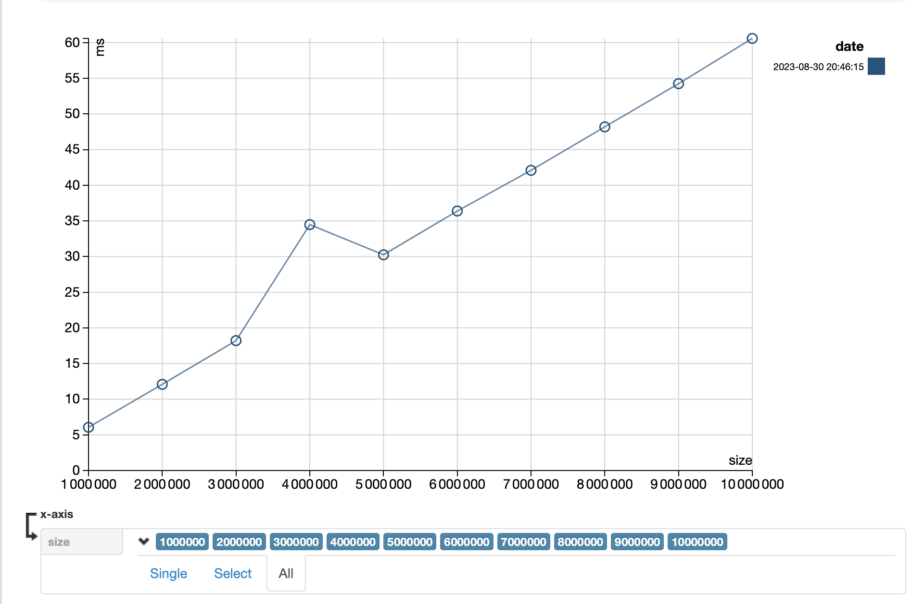
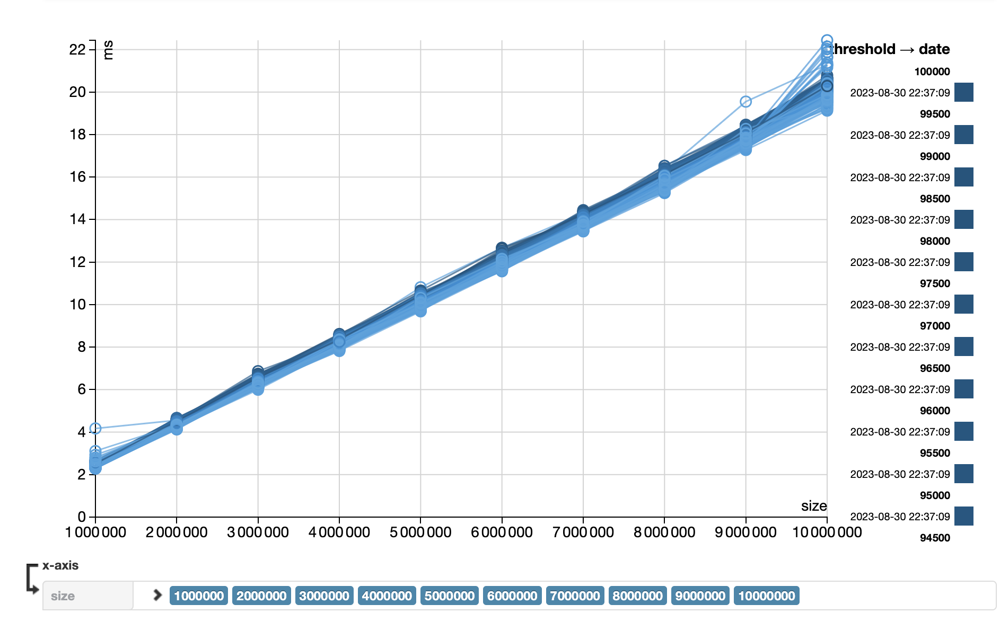
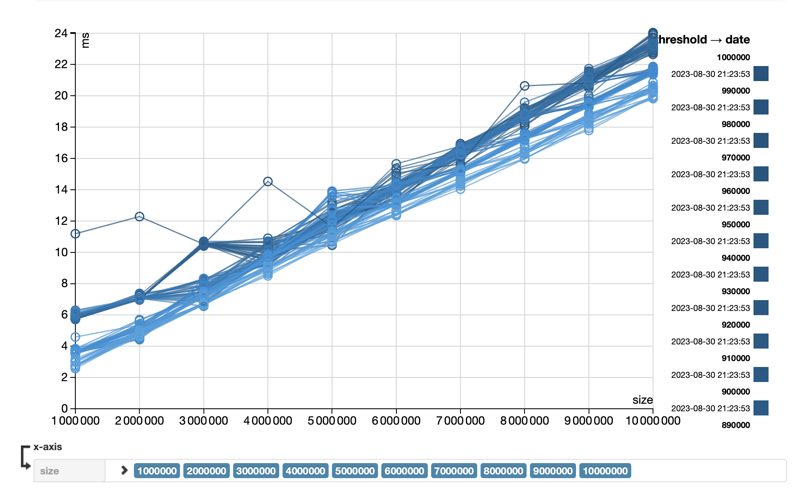
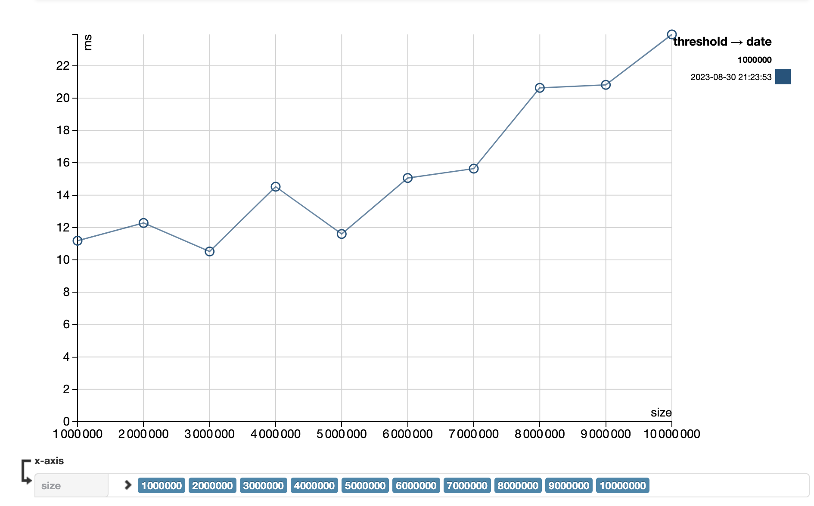
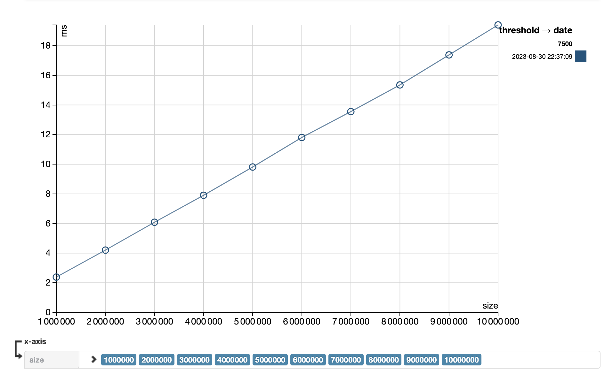

# Parallel vs Sequential scan

This demo project shows advantages of parallel scan algorithm over its sequential counterparts.
It measures performance of both approaches using `Scalameter` library and builds diagrams. For sequential scan it additionally 
compares performance based on different split threshold.

## Usage
To run tests and generate benchmark reports, execute the following commands:
```shell
sbt clean
sbt compile
sbt test
```

Alternatively, it's possible to run tests in docker
```shell
docker run -d -v "$(pwd)/output":/opt/Docksbt/scala-project/benchmarks alekslitvinenk/par-scan:latest test
```

**⚠️ Note:** Tests run might take quite some time.

Benchmark reports will be generated in `benchmarks` folder

## Conclusions
**⚠️ Note:** All performance tests were run in cloud VM with 8 vcors and 8GB memory.

Sequential scan gives us pretty steep linear curve, where execution time grows proportionally to the size of input data,
that is O(n). For the inout size of 1M elements we get 6ms and for 10M - 60ms. Extrapolating this results we would expect
to get 600ms, 6s, 1m for 100M, 1 000M and 10 000M elements respectively, provided we have enough RAM.



Parallel scan execution times vary depending on the input size and threshold. On parallel-small-thresholds tests were run
with the threshold ranging from 500 to 100 000. And on parallel-big-thresholds picture we can see benchmark results for
thresholds ranging from 10 000 to 1 000 000.




It is easy to spot that, generally smaller thresholds give better performance than bigger ones. The worst performance was
achieved with the threshold equating to 1 000 000. (see pic below)



By iteratively comparing and excluding curves on the chart with small thresholds we can find the curve that shows the
best performance. In our case, the best result is achieved with 7500 chosen as the threshold. (see pic below)



The execution times are 2.4ms for 1M elements and 20ms for 10M elements, which again shows us linear or O(n) computation
complexity. Extrapolating this results we would expect to get 200ms, 2s, 20s for 100M, 1 000M and 10 000M elements 
respectively, provided we have enough RAM.

Comparing sequential and best parallel benchmarks we can see that, on average, the performance gain with parallel scan
is 3x.

Modern computers are designed to yield high performance when the task can be parallelized. In recent years, even consumer
laptops, use to have multiple physical cores. If that's not enough, often, computer manufacturers implement physical
CPU core in such a way that it's capable of handling 2 command pipelines simultaneously, thus turning 1 physical core
into 2 logical.

To summarize this journey, we can say that with modern computer architecture we should strive to parallelize all tasks
whenever it's possible.